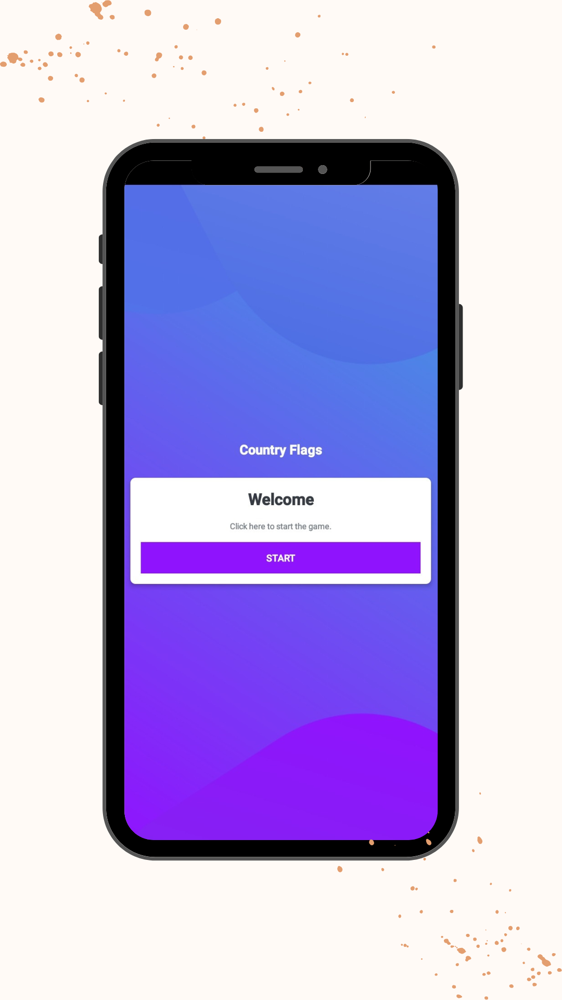
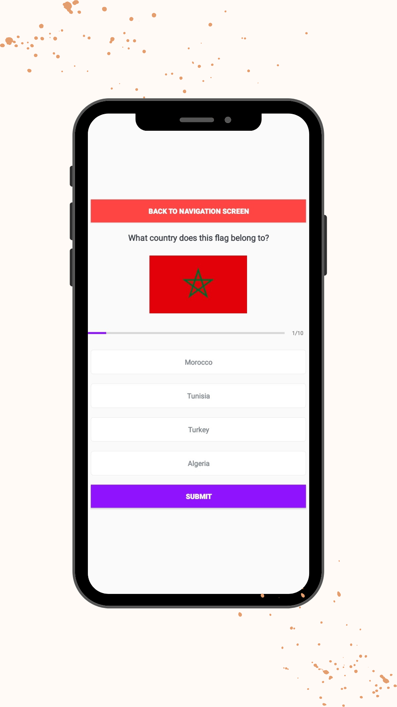

# Flage Names Quiz App

## Screenshots

Here are some screenshots from different pages of the Flage Names Quiz App:

  
  
  
  
  

## Description

Flage Names is a Kotlin quiz app that tests your knowledge of country flags. It presents you with flag images and multiple-choice questions to guess the corresponding country name. The app aims to provide an interactive and enjoyable way to learn and test your knowledge of flags from around the world.

## Features

- User-friendly interface for an intuitive quiz experience.
- Multiple-choice questions with options for users to select the correct country name.
- Instant feedback on the correctness of the answer.
- Score tracking to keep track of the user's progress.
- End-of-quiz summary displaying the final score and the number of correct answers.
- Option to restart the quiz to challenge oneself again.
- The ability to choose a certain difficulty level (Easy - Intermediate - Hard)

## Installation

To run the Flage Names Quiz App locally, follow these steps:

1. Ensure you have the latest version of Kotlin installed on your machine.
2. Clone the repository to your local machine using the following command:

`git clone https://github.com/your-username/flage-names.git`

3. Open the project in your preferred Kotlin development environment (e.g., IntelliJ IDEA, Android Studio).
4. Build and run the app on an emulator or a physical device.

## Dependencies

The Flage Names Quiz App utilizes the following dependencies:

- Kotlin standard library
- AndroidX Core KTX: Android Jetpack core library extension for Kotlin.
- AndroidX AppCompat: Android Jetpack's compatibility library for supporting older versions of Android.
- Material Components for Android: Material Design components for Android applications.

Make sure to resolve and sync the dependencies before running the app.

## Usage

1. Launch the Flage Names Quiz App on your device.
2. The app will display in the ain activity a welcome message and a button to click in order to navigate to the next screen.
3. the app will display a navigation section to choose a difficulty level
4. The app will display a flag image and multiple-choice options.
5. Select the correct country name from the provided options.
6. Instant feedback will be provided, indicating whether your answer is correct or incorrect.
7. Continue answering questions until the quiz ends.
8. At the end of the quiz, a summary will be displayed showing your final score and the number of correct and incorrect answers.
9. If you wish to restart the quiz, tap the Finish button.

## License

The Flage Names Quiz App is released under the [MIT License](LICENSE).

## Acknowledgments

- The app was developed as a learning project and inspired by the desire to improve knowledge of country flags.

Feel free to reach out with any questions or feedback. Enjoy the Flage Names Quiz App!
